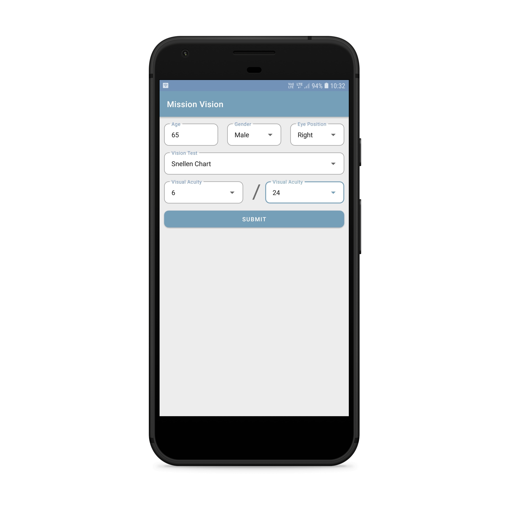
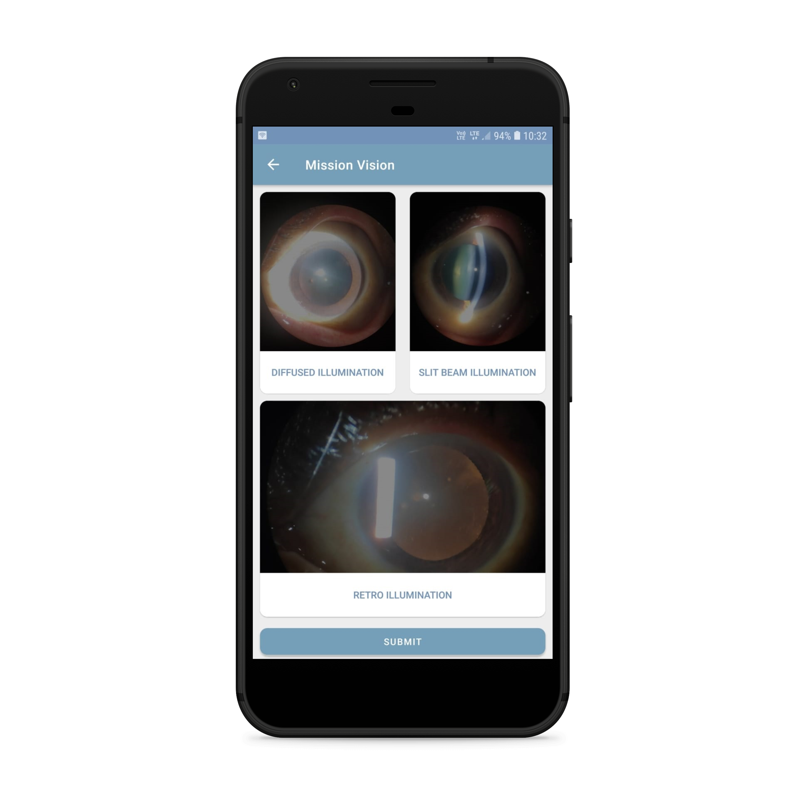
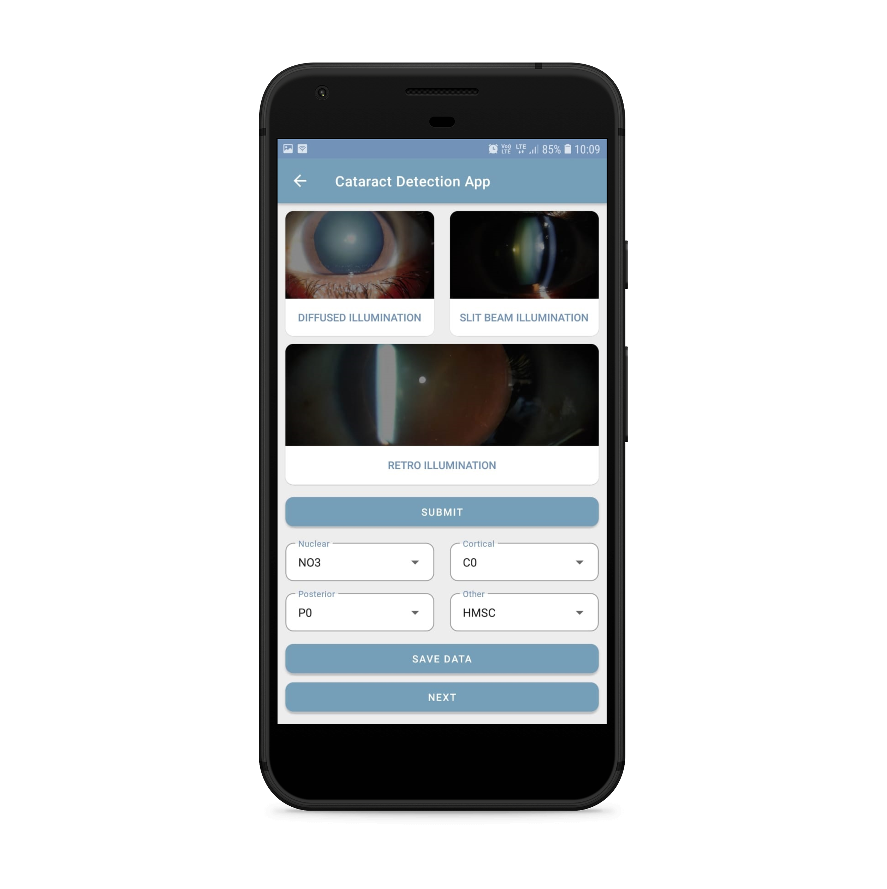

# Cataract-Detection-App

With advancement in technology, devices which can detect both existing cataracts and those which are likely to develop in future are developed. 
In India, these devices can cost upwards of 5 lakh Rupees to as much as 10 lakh rupees. 
To set up these devices in every diagnostic center is not cost-effective, keeping in view of initial investment maintenance costs. 
This problem can be solved by using the Slit-Lamp testing procedure where the whole setup costs between 50,000 to 1 lakh rupees. 
With the help of an adaptor (of less than Rs. 1000), a smartphone can be attached to the eye-piece of the slit-lamp to capture images of the eye. 
With the growing need to detect cataracts cost-effectively for most of our population (rural areas and economically backward sections), we believe that our app, **Mission Vision** can help a lot. 
It makes the process of early detection and grading of cataracts much more streamlined and accurate.

The app runs in Android mobile phones without needing any internet connection. It presents the examiner with a clean UI. It takes input three different images of the eye in different forms of illuminations (**diffused**, **slit-beam** and **retro illumination**). These three images along with the vision acuity reading are then fed into a neural network which predicts the type of the cataract and also the grade associated with it. Cataracts can be of many different types: **nuclear** (center of the lens), **cortical** (periphery of the lens) and **posterior** (back side of the lens). The LOCS III system provides an objective reference system to grade these with few more types not standardized: **MSC**, **HMSC** and **PPC**. We have trained our AI model to also recognize these based on the reference training data provided by the eye doctors. The reference images are also being collected by the same app.

## Instructions to use the app
****
The apk of the app can be found [here](https://drive.google.com/file/d/1eQGgBUCcB15kUgNfLG8fHAbv6IEEGbtj/view?usp=sharing)
1. On opening the app the examiner is welcomed with a screen to enter the demographics of the patient such as Age, Gender, Eye position, Vision acuity readings
2. Next the app asks for the main inputs i.e the images of the eye which can be captured from the camera or gallery
3. On submitting these inputs, the app outputs four different labels in the order Nuclear, Cortical, Posterior and Other corresponding to the grades of different cataracts
4. With the click of save the data button, a folder with the name composed of labels and other details is generated and the images are stored there
5. The examiner can now move to the next patient

  

## Additional Information
****
### Permissions Required
The app needs the access to the following

**Camera**: For capturing the eye-images of the examinee

**Storage**: To read and write the images from the storage, either internal or external like SD card.

You can find more details about the [application concept](https://docs.google.com/document/d/1kRbsgFSeXnilSGo2mpy9eqYc-9lUmi6XoHe7FusfGDE/edit?usp=sharing) and need of such an app [here](https://docs.google.com/document/d/1ji1M3Lf9x_caIgEjh_BRXn4D8OkeU1IIIL9fiGIubZo/edit?usp=sharing).